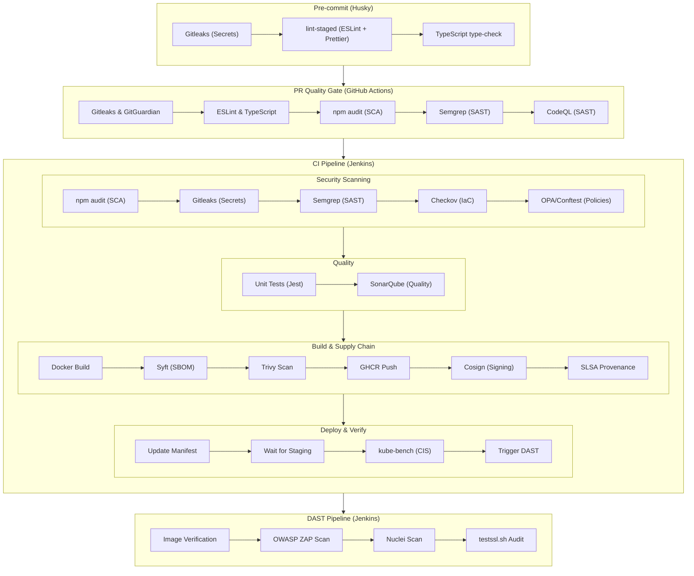

# BoostFlow - DevSecOps Pipeline

  
  
  

Source code for the B.Sc. Thesis **"Design and Implementation of a DevSecOps Lifecycle"** by [Dimitrios Koutsompinas](https://github.com/KDim67).

> **Historical Context**: The core application (BoostFlow) was originally developed as a team project for the DevOps course by [Dimitrios Koutsompinas](https://github.com/KDim67), [Evangelos Leivaditis](https://github.com/EvanLei-git), and [Nikolaos Douros](https://github.com/nikosd767).
>
> **Thesis Scope**: All commits after tag `team-submission-final` (Date: 12/09/2025) represent the individual work of [Dimitrios Koutsompinas](https://github.com/KDim67).

BoostFlow is an AI-powered team productivity platform (Next.js, Firebase, TypeScript) used as the target application for this pipeline. For web application documentation, see [WEBAPP.md](WEBAPP.md).

For the Kubernetes manifests and platform configuration (GitOps), see [boostflow-thesis-config](https://github.com/KDim67/boostflow-thesis-config).

## Repository Layout

This project uses a **two-repository structure**:

- **boostflow-thesis** (this repo): contains the Next.js application source code alongside all CI/CD pipeline definitions, security scanner configurations, OPA policies, and Ansible infrastructure provisioning.
- **[boostflow-thesis-config](https://github.com/KDim67/boostflow-thesis-config)**: GitOps repository holding Kubernetes manifests, ArgoCD Application CRs, and platform component configurations (monitoring, security, compliance, backup). Jenkins updates the image digest in this repo; ArgoCD syncs changes to the cluster.

## Pipeline Overview

## CI Pipeline

The main Jenkins pipeline (`Jenkinsfile`) executes the following stages sequentially.

### Security Scanning

Secret detection and static analysis run in three layers — pre-commit hooks, GitHub Actions on PR, and the Jenkins CI pipeline — so that issues are caught as early as possible and nothing reaches `main` unchecked.

- **npm audit**: SCA; fails on CRITICAL, marks unstable on HIGH. Report: `npm-audit.json`
- **Gitleaks**: secret detection across full repository history. Pinned image `zricethezav/gitleaks:v8.21.2`. Configured via `.gitleaks.toml` (custom rules for Firebase, SendGrid, MinIO, OAuth, Gemini keys). Report: SARIF format
- **Semgrep SAST**: pattern-based static analysis targeting application-layer vulnerabilities (injection, auth bypass, insecure config). Rulesets: `p/typescript`, `p/javascript`, `p/react`, `p/security-audit`, `p/secrets`. Scans `src/` directory. Pinned image `semgrep/semgrep:1.95.0`. Reports: SARIF + JSON + text
- **Checkov IaC**: Dockerfile policy scanning against CIS benchmarks. Pinned image `bridgecrew/checkov:3.2.256`. Fails on any violation
- **OPA/Conftest**: custom Rego policy enforcement on Dockerfile and Kubernetes manifests (clones config repo to scan `app-deployment.yaml` and `minio-statefulset.yaml`). Policies in `policies/` directory. Pinned image `openpolicyagent/conftest:v0.56.0`

### Quality

Code must pass both functional tests and a SonarQube quality gate before the image is built.

- **Unit Tests**: `npm run test:coverage` with Jest. JUnit report archived
- **SonarQube**: code quality and coverage analysis. Pinned scanner image `sonarsource/sonar-scanner-cli:11.1`. Configured via `sonar-project.properties`. Quality gate enforced (`sonar.qualitygate.wait=true`)

### Build & Supply Chain

The image is built with a hardened multi-stage Dockerfile, then wrapped in a verifiable supply chain: SBOM, vulnerability scan, cryptographic signature, and SLSA provenance — all before it reaches the registry.

- **Docker Build**: multi-stage build. Builder: `node:20-alpine`. Production: pinned `distroless/nodejs20-debian12` (by SHA256 digest). Distroless eliminates the OS package manager, shell, and all non-essential binaries — reducing the attack surface to just the Node.js runtime. Runs as non-root user (UID 65532) with read-only root filesystem. BuildKit `--secret` mounts inject environment variables at build time without persisting them in any image layer. Healthcheck included
- **SBOM Generation**: Syft generates CycloneDX SBOMs from both `package-lock.json` (source dependencies) and the built Docker image (OS-level packages). Two SBOMs ensure both application and runtime dependencies are inventoried
- **Trivy Vulnerability Scan**: scans both SBOMs. Fails on fixable CRITICAL vulnerabilities. Generates HTML report
- **Push to GHCR**: pushes image with build-specific tag (`{BUILD_NUMBER}-{COMMIT_SHORT}`) and `latest`
- **Cosign Signing**: signs the image by its immutable digest (not tag) using a key pair stored in Vault, ensuring that any tampering between push and deployment is detectable. Attaches the CycloneDX SBOM as a signed attestation, binding the dependency inventory to the exact image that was scanned
- **SLSA Provenance**: generates a [SLSA](https://slsa.dev/) provenance attestation recording _what_ was built, _from which_ source commit, _by which_ builder, and _when_. Attached to the image via Cosign so downstream consumers can verify build origin. At deploy time, a Kyverno admission policy verifies the Cosign signature before the cluster accepts the image (see [Infrastructure Provisioning](#infrastructure-provisioning))

### Deploy & Verify

Deployment is fully GitOps-driven: the pipeline never talks to the cluster directly — it pushes a manifest change and waits for ArgoCD to reconcile.

- **Update K8s Manifest**: clones `boostflow-thesis-config`, updates image digest in `app-deployment.yaml` via `sed`, commits and pushes
- **Wait for Staging**: polls until ArgoCD syncs the new digest. Verifies rollout status and health endpoint (`/api/health`)
- **CIS Benchmark**: triggers a kube-bench Job (from the CronJob in the compliance namespace). Archives results
- **Trigger DAST**: fires the separate DAST pipeline (`boostflow-dast`) asynchronously, passing image tag and source build URL

## DAST Pipeline

Separate Jenkins pipeline (`Jenkinsfile.dast`) triggered after successful CI deployment.

- **Image Verification**: confirms the running deployment matches the expected digest from the config repo before scanning
- **OWASP ZAP**: baseline scan against staging URL. Uses `ghcr.io/zaproxy/zaproxy:stable`. Configured via `zap.conf` (tuned ignore rules for Next.js/Firebase-specific false positives). Exit code 1 = FAIL (blocks), 2 = WARN (unstable)
- **Nuclei**: vulnerability scanning with `projectdiscovery/nuclei:v3.3.5`. Severity filter: medium, high, critical. Rate-limited (50 req/s, 5 concurrent). Fails on critical/high findings
- **testssl.sh**: TLS/SSL configuration audit with `drwetter/testssl.sh:3.2`. Report archived as JSON

Both pipelines send HTML email notifications (success/failure/unstable) via `mail`.

## PR Quality Gate

**PR Checks** (`.github/workflows/pr-checks.yml`) — runs on pull requests to `main`:

- ESLint (`npm run lint`)
- TypeScript type-check (`npm run type-check`)
- npm audit (`--audit-level=high`)
- Semgrep (same rulesets as CI: typescript, javascript, react, security-audit, secrets)
- Gitleaks

**CodeQL Security Analysis** (`.github/workflows/codeql.yml`) — runs on push and pull requests to `main`:

- Semantic code analysis (SAST) for JavaScript/TypeScript vulnerabilities and security flaws

**GitGuardian** (`.github/workflows/gitguardian.yml`) — runs on push and PR to `main`:

- GitGuardian secret scanning via `ggshield-action@v1`

## Pre-commit Hooks

Husky pre-commit hook (`.husky/pre-commit`) runs three checks before each commit:

1. **Gitleaks** — scans staged files for secrets (if installed locally)
2. **lint-staged** — runs ESLint `--fix` and Prettier `--write` on staged `.js/.jsx/.ts/.tsx` files; Prettier on `.json/.md/.yaml/.yml` (configured in `.lintstagedrc.json`)
3. **TypeScript type-check** — `npm run type-check`

## OPA Policies

Three Rego policy files in `policies/` enforce organizational standards via Conftest. These are evaluated in the CI pipeline's OPA/Conftest stage against the Dockerfile and Kubernetes manifests from the config repo.

**`dockerfile.rego`** — Dockerfile hardening:

- Base images must be pinned by version or digest (no `latest`, no untagged)
- Must include a `USER` instruction (non-root)
- `COPY` over `ADD` for local files
- Blocks piping `curl`/`wget` to shell (`curl | bash`)

**`kubernetes.rego`** — Kubernetes manifest security (applies to Deployments and StatefulSets):

- Containers must run as non-root (`runAsNonRoot: true`)
- Privilege escalation must be disabled
- Root filesystem must be read-only
- All capabilities must be dropped (`drop: [ALL]`)
- Resource requests and limits must be set
- Liveness and readiness probes required
- No `hostNetwork` or `hostPID`
- Images must be pinned by SHA256 digest
- `automountServiceAccountToken` must be false
- Seccomp profile must be set

**`firebase.rego`** — Firebase Firestore rules:

- Denies wide-open read or write access on any collection (`read: true` / `write: true`)

## Infrastructure Provisioning

The `ansible/` directory contains an Ansible playbook that provisions a single-node Kubernetes cluster from scratch.

**Playbook**: `ansible/playbooks/provision-cluster.yml`

What it provisions (in order):

1. System preparation — disable swap, load kernel modules, configure sysctl for Kubernetes networking
2. Container runtime — containerd with SystemdCgroup
3. Kubernetes — kubeadm init, Calico CNI, single-node (control-plane taint removed)
4. Storage — Rancher Local Path Provisioner (default StorageClass)
5. Helm + Helm repos
6. Namespaces with Pod Security Standards (restricted for app/backup, privileged for compliance)
7. Ingress — NGINX Ingress Controller
8. GitOps — ArgoCD + repository credentials + root Application (App-of-Apps)
9. Automation — AWX Operator + AWX instance
10. Secrets management — HashiCorp Vault (via dedicated Ansible role `ansible/roles/vault/`)
11. Image signature verification — Kyverno admission controller with a `verifyImages` ClusterPolicy that checks Cosign signatures on every Pod admitted to the application namespace. This closes the supply chain loop: the CI pipeline signs the image after build, and Kyverno rejects any image that wasn't signed with the matching key
12. GHCR pull secret for the application namespace
13. CI/CD tooling — custom Jenkins container (from `Dockerfile.jenkins`), SonarQube container

**Supporting files**:

- `ansible/inventory/` — staging and production inventory files
- `ansible/group_vars/` — variable definitions (Kubernetes versions, Helm chart versions, network CIDRs)
- `ansible/secrets.vault.yml` — Ansible Vault-encrypted secrets
- `ansible/roles/vault/` — Ansible role for HashiCorp Vault deployment and configuration

## Jenkins Agent

Custom Jenkins agent image defined in `Dockerfile.jenkins`. Based on `jenkins/jenkins:lts`, extended with:

| Tool       | Role in Pipeline                                                |
| ---------- | --------------------------------------------------------------- |
| Node.js 20 | Runs `npm ci`, Jest tests, and the Next.js production build     |
| Docker CLI | Builds the application image and pushes to GHCR                 |
| Syft       | Generates CycloneDX SBOMs from source and image                 |
| Trivy      | Scans SBOMs for HIGH/CRITICAL vulnerabilities                   |
| Cosign     | Signs images by digest and attaches SBOM/SLSA attestations      |
| kubectl    | Polls deployment rollout, triggers kube-bench, reads pod status |

## Scanner Configuration

Configuration files that tune security scanner behavior:

| File                       | Scanner   | Purpose                                                                                                                                                              |
| -------------------------- | --------- | -------------------------------------------------------------------------------------------------------------------------------------------------------------------- |
| `.gitleaks.toml`           | Gitleaks  | Custom rules for Firebase, SendGrid, MinIO, OAuth, and Gemini API keys. Allowlist for false positives in example/template files                                      |
| `.semgrepignore`           | Semgrep   | Excluded paths/patterns                                                                                                                                              |
| `zap.conf`                 | OWASP ZAP | Tuned alert rules — ignores informational and Next.js/Firebase-specific false positives (e.g., `unsafe-inline` for Tailwind, HttpOnly for CSRF double-submit cookie) |
| `sonar-project.properties` | SonarQube | Source paths, coverage paths, exclusions (UI components, Firebase infra), quality gate enforcement                                                                   |
